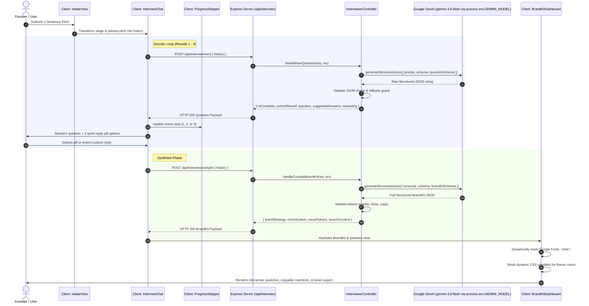
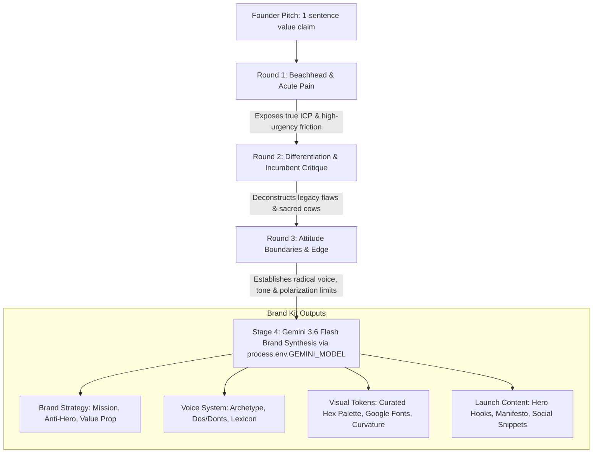

# Brand Builder: Architecture & Agent Navigation Graph

This document serves as the visual and semantic architectural guide for human developers and autonomous AI pair agents. It details the end-to-end data lifecycle, agent state transitions, and component-to-endpoint dependency matrix.

---

## 1. End-to-End System Sequence Diagram

The following Mermaid sequence diagram traces how user input flows from initial beachhead pitch through adaptive Socratic questioning to dynamic design token compilation.

---

## 2. Component-to-API Dependency Matrix

Incoming AI agents must reference this matrix when altering state payloads or modifying contracts:

| React Component | File Path | Express Endpoint | Method | Request Payload | Response Schema | Fallback Behavior |
| :--- | :--- | :--- | :--- | :--- | :--- | :--- |
| `IntakeView.jsx` | `client/src/components/IntakeView.jsx` | *None (Local state)* | - | - | - | Emits `onStartInterview(pitch)` or loads demo mock |
| `InterviewChat.jsx` | `client/src/components/InterviewChat.jsx` | `/api/interview/next` | `POST` | `{ history: Array<{role, content}> }` | `QuestionResponse` (`questionSchema`) | Offline deterministic questions with 3 adaptive pill chips |
| `InterviewChat.jsx` | `client/src/components/InterviewChat.jsx` | `/api/interview/compile` | `POST` | `{ history: Array<{role, content}> }` | `BrandKit` (`brandKitSchema`) | High-fidelity mock brand kit with dynamic palette & fonts |
| `ProgressStepper.jsx` | `client/src/components/ProgressStepper.jsx` | *None (Pure UI)* | - | `{ currentRound: 1\|2\|3, isComplete: boolean }` | Visual status tracker | Shows completion state & active pulse animation |
| `BrandKitDashboard.jsx`| `client/src/components/BrandKitDashboard.jsx`| *None (Consumer)* | - | `BrandKit` object | Interactive visualizer | Self-contained Google Font injector & HEX copy buttons |

---

## 3. Prompt Chain Architecture & Socratic Logic

The pipeline operates across 3 adaptive Socratic rounds before synthesizing into the Brand Kit:

---

## 4. Multi-Agent Navigation Guide

When joining this repository as an AI agent:
1. Check `DEVSTATE.md` to see the current active sprint stage and unresolved blockers.
2. If modifying prompt outputs or response shapes, keep `client/src/types/brand.ts` and `server/controllers/interviewerController.js` in strict parity.
3. Keep mock fallbacks enabled so all CI and local testing passes without requiring an active `GEMINI_API_KEY`.
